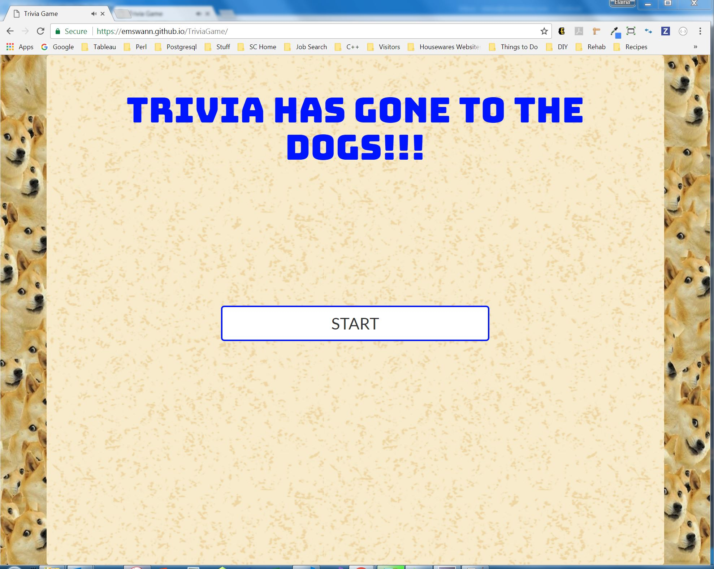
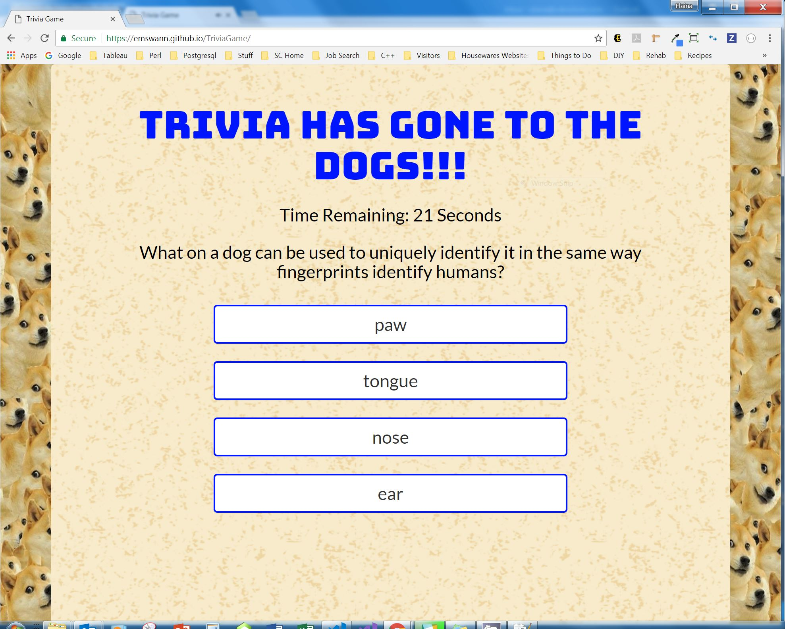
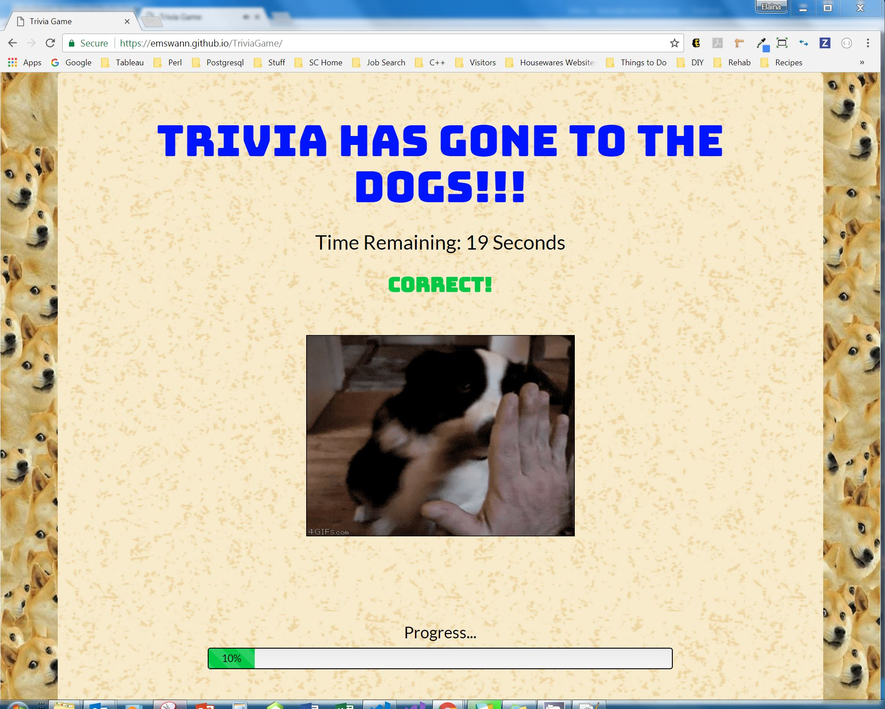
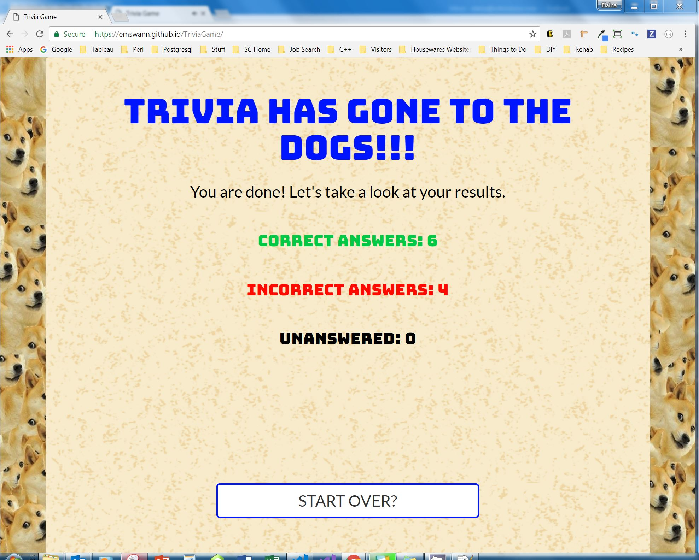

# TriviaGame
Trivia Game using JavaScript for logic, jQuery to manipulate HTML, and timers to add excitement for answering questions.

Trivia Game asks the user 10 questions. The user has 30 seconds to answer each question. The correct answer is given after each guess, along with an associated gif. The results are tallied after all 10 questions are guessed and reported to the user.

## Site Preview

## Getting Started

You should be able to download the files via the github pages link below and run locally on your computer:

[https://github.com/emswann/TriviaGame.git](https://github.com/emswann/TriviaGame.git).

You can also access the application via the github pages link below:

[https://emswann.github.io/TriviaGame/](https://emswann.github.io/TriviaGame/).

## Prerequisites

No prior software needed to run.

## Built With

* [Bootstrap](https://getbootstrap.com/docs/3.3/) - Front-end HTML, CSS, javascript framework for creating responsive web applications. 
* [JavaScript](https://www.javascript.com/) - Programming language.
* [jQuery](https://jquery.com/) - Javascript library.

## Contributing

Please feel free to offer any suggestions. As always, programming is a work of art in progress.

## Author

* **Elaina Swann** - [Github](https://github.com/emswann)